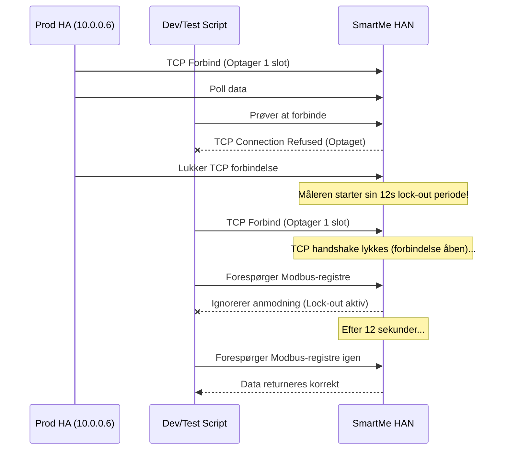

# Smart-me Kamstrup HAN: målerens to timing-krav — og fælden ved at teste mod den

**Hvad:** HAN-modulet har to *uafhængige* forsinkelseskrav. Kun det ene stod i domænenoterne. Begge er nu målt mod hardwaren frem for gættet.

## De to forsinkelser
- **~2,5 s mellem forespørgsler** — ikke mellem registre. Målt: 0,3 s droppes, 2,5 s besvares. Konsekvensen er kontraintuitiv: man vinder intet ved at læse *færre registre*, kun ved at læse dem i **færre forespørgsler**. Blok-læsning virker (12 registre i én FC03 på 0,02 s), så de ni værdier hentes nu i tre blokke: 8195×2, 8211×12, 8267×4.
- **~12 s efter en forbindelse lukkes**, før modulet besvarer den første forespørgsel på en ny. Målt: 2,5 / 5 / 8 s droppes, 12 s besvares. TCP-handshaket lykkes hele vejen — forbindelsen *accepteres*, men serviceres ikke. Det er den hyppigste kilde til "uforklarlige" timeouts lige efter opsætning eller reload.

## Fælden: måleren har ét TCP-slot
Modulet tillader **én** aktiv Modbus TCP-forbindelse. Prod-HA på `10.0.0.6` poller den kontinuerligt. Kører man samtidig hardware-tests fra serveren (eller dev-containeren i repoet), slås de to om slottet, og **begge parter** ser tilfældigt droppede forespørgsler.

Det kostede reelt: jeg konkluderede først at måleren havde en "opvågningsadfærd", og byggede en persistent forbindelse oven på den antagelse. Efter at have deaktiveret integrationen på prod og gentaget forsøgene viste genforbindelse sig at koste *ingenting* — og en persistent forbindelse ville have monopoliseret målerens eneste slot permanent, så dev og prod aldrig kunne køre samtidig. Rullet tilbage.

**Visuel repræsentation af TCP-kollision:**

**Regel fremadrettet:** deaktivér `smartme_han` på `10.0.0.6` før enhver hardware-test mod måleren, og genaktivér bagefter (ellers mister vi måledata imens).

## pymodbus-faldgruber
- `reconnect_delay=0` er giftigt: `connect()` melder succes på en forbindelse der med mellemrum ikke transporterer nogen forespørgsler (målt 0/4 svar, to gange). Brug en værdi > 0.
- Unit-id-parameteren hed `slave` til og med 3.9 og hedder `device_id` fra 3.11. Slå navnet op **én gang** med `inspect.signature` — ikke `try/except TypeError` pr. kald.
- Pin **ikke** pymodbus eksakt i `manifest.json`. HA core pinner selv en version til sin indbyggede `modbus`-integration (2026.5 → `3.11.2`); en eksakt pin fra en custom component giver pip-konflikt for brugere der har begge. Brug `pymodbus>=3.8.0`.

## Resultat
Poll gik fra 23,6 s til ~5,5 s — verificeret i drift på `10.0.0.6`, ikke kun på testbænken. Opstarten blokeres ikke længere, og forbindelsen frigives mellem polls, så andre værktøjer kan nå måleren ~54 af hver 60 sekunder.

**Links:** [[../projekter/smartme-han]] · repo `/hostrup/data/dev/smartme_han` · `.agents/skills/smart-me-kamstrup.md` i repoet er opdateret tilsvarende (gitignored, så den følger ikke med til HACS).
